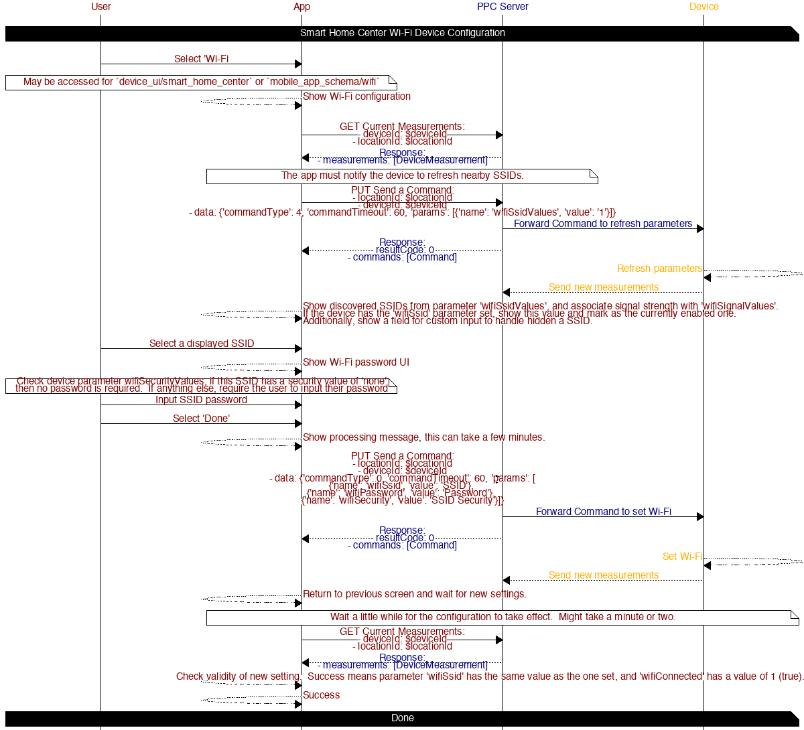

# Device Configuration

## Table of contents

* [Smart Home Center Wi-Fi](#smart-home-center-wifi)

## Diagrams

### Smart Home Center Wi-Fi

Configuring Wi-Fi for the Smart Home Center device types is done by using device commands to interact with the device.  This requires the device to be connected to the Cloud.

#### APIs

##### [GET List of Devices](https://iotapps.docs.apiary.io/#reference/devices/manage-devices/get-a-list-of-devices)

*Refreshing devices at the current location*

Params:
- locationId: $locationId _Current Location ID_
- checkPersistent: true _Determine if the device is connected_

##### [PUT Send A Command](https://iotapps.docs.apiary.io/#reference/device-measurements/parameters-for-a-specific-device/send-a-command)

*Notify device to refresh discover SSIDs*

Params:
- locationId: $locationId _Current Location ID_
- deviceId: $deviceId _Smart Home Center Device ID_
- data: `{'commandType': 0, 'commandTimeout': 60, 'params': [{'name': 'wifiSsidValues', 'value': '1'}]}`

*Notify device to connect to Wi-Fi*
Params:
- locationId: $locationId
- deviceId: $deviceId
- data: `{'commandType': 0, 'commandTimeout': 60, 'params': [\n{'name': 'wifiSsid', 'value': 'SSID'}, \n{'name': 'wifiPassword', 'value': 'Password'}, \n{'name': 'wifiSecurity', 'value': 'SSID Security'}]}`

##### [GET Current Measurements](https://iotapps.docs.apiary.io/#reference/device-measurements/parameters-for-a-specific-device/get-current-measurements)

*Refresh device parameters to retrieve discovered SSIDs and to validate Wi-Fi connection state*

Params:
- locationId: $locationId
- deviceId: $deviceId
