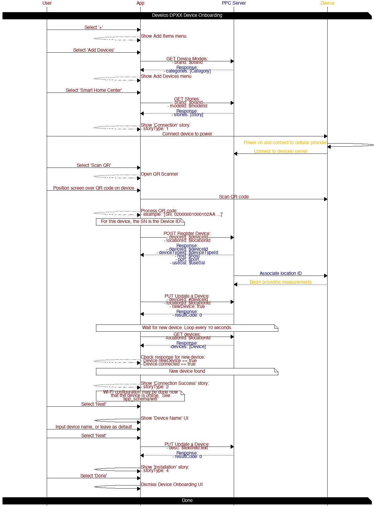
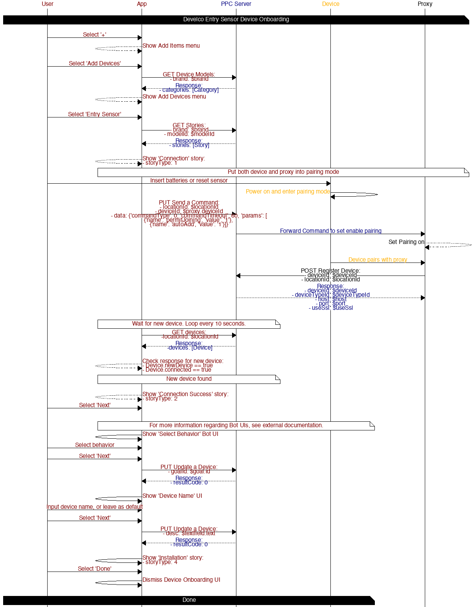

# Device Onboarding

## Table of contents

* [Develco DPXX](#develco-dpxx)
* [Develco Entry Sensor](#develco-entry-sensor)
* [Vayyar Home](#vayyar-home)

## Diagrams

### Develco DPXX

#### APIs

##### [GET Device Models](https://iotapps.docs.apiary.io/#reference/creating-products/device-models/get-device-models)

*Gather device models*

Params:
- brand: $brand

##### [GET Stories](https://iotapps.docs.apiary.io/#reference/creating-products/stories/get-stories)

*Gather device model stories*

Params:
- brand: $brand
- modelId: $modelId

##### [POST Register Device](https://iotapps.docs.apiary.io/#reference/devices/manage-devices/register-a-device)

*Register device*

Params:
- deviceId: $deviceId
- locationId: $locationId

##### [PUT Update a Device](https://iotapps.docs.apiary.io/#reference/devices/manage-single-device/update-a-device)

*Mark device as new*

Params:
- deviceId: #deviceId
- locationId: $locationId
- newDevice: true

*Update device name*

Params:
- desc: $textfield.text

##### [GET devices](https://iotapps.docs.apiary.io/#reference/devices/manage-devices/get-a-list-of-devices)

Params:
- locationId: $locationId

### Develco Entry Sensor

#### APIs

##### [GET Device Models](https://iotapps.docs.apiary.io/#reference/creating-products/device-models/get-device-models)

*Gather device models*

Params:
- brand: $brand

##### [GET Stories](https://iotapps.docs.apiary.io/#reference/creating-products/stories/get-stories)

*Gather device model stories*

Params:
- brand: $brand
- modelId: $modelId

##### [PUT Send a Command](https://iotapps.docs.apiary.io/#reference/device-measurements/parameters-for-a-specific-device/send-a-command)

*Put proxy into pairing mode*

Params:
- locationId: $locationId
- deviceId: $proxy.deviceId
- data: `{'commandType': 0, 'commandTimeout': 60, 'params': [\n{'name': 'permitJoining', 'value': '1'}, \n{'name': 'autoAdd', 'value': '1'}]}`

##### [GET devices](https://iotapps.docs.apiary.io/#reference/devices/manage-devices/get-a-list-of-devices)

*Refresh devices*

Params:
 -locationId: $locationId

##### [PUT Update a Device](https://iotapps.docs.apiary.io/#reference/devices/manage-single-device/update-a-device)

*Update device goal (See Synthetic API [Behaviors](synthetic_apis/behaviors.md))*

Params:
- goalId: $goal.id

*Update device name*

Params:
- desc: $textfield.text

### Vayyar Home

*Vayyar Home BLE configuration* 

1 Scan S/N
2 Register Device
3 Connect BLE
4 Configure Wi-Fi
5 Configure Cloud
6 Check Firmware
7 Update Firmware
8 Reboot

#### APIs

##### [GET Device Models](https://iotapps.docs.apiary.io/#reference/creating-products/device-models/get-device-models)

*Gather device models*

Params:
- brand: $brand

##### [GET Stories](https://iotapps.docs.apiary.io/#reference/creating-products/stories/get-stories)

*Gather device model stories*

Params:
- brand: $brand
- modelId: $modelId

##### [POST Register Device](https://iotapps.docs.apiary.io/#reference/devices/manage-devices/register-a-device)

*Register device*

Params:
- deviceId: $deviceId
- locationId: $locationId

##### [GET devices](https://iotapps.docs.apiary.io/#reference/devices/manage-devices/get-a-list-of-devices)

*Refresh devices*

Params:
 -locationId: $locationId

##### [PUT Update a Device](https://iotapps.docs.apiary.io/#reference/devices/manage-single-device/update-a-device)

*Update device name*

Params:
- desc: $textfield.text
