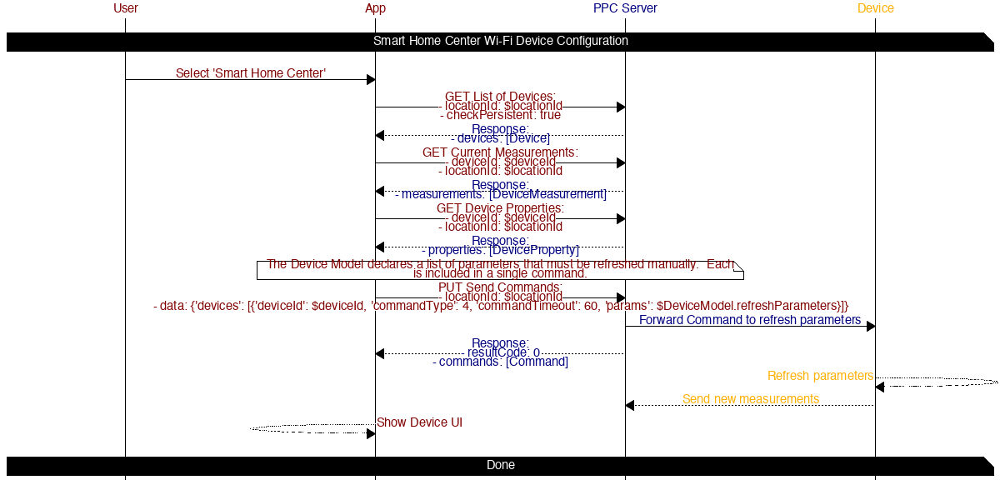

# Device UI

## Table of contents

* [Smart Home Center](#smart-home-center)

## Diagrams

### Smart Home Center

#### APIs

##### [GET List of Devices](https://iotapps.docs.apiary.io/#reference/devices/manage-devices/get-a-list-of-devices)

*Refresh devices*

Params:
- locationId: $locationId
- checkPersistent: true

##### [GET Current Measurements](https://iotapps.docs.apiary.io/#reference/device-measurements/parameters-for-a-specific-device/get-current-measurements)

*Refresh device parameters*

Params:
- deviceId: $deviceId
- locationId: $locationId

##### [GET Device Properties](https://iotapps.docs.apiary.io/#reference/devices/device-properties/get-device-properties)

*Refresh device properites*

Params:
- deviceId: $deviceId
- locationId: $locationId

##### [PUT Send Commands](https://iotapps.docs.apiary.io/#reference/device-measurements/parameters-for-a-specific-device/send-a-command)

*Notify device to refresh parameters*

_Note: The device model's `displayInfo` property describes what parameter names to include_

Params:
- locationId: $locationId
- data: `{'devices': [{'deviceId': $deviceId, 'commandType': 4, 'commandTimeout': 60, 'params': $DeviceModel.refreshParameters}]}`
