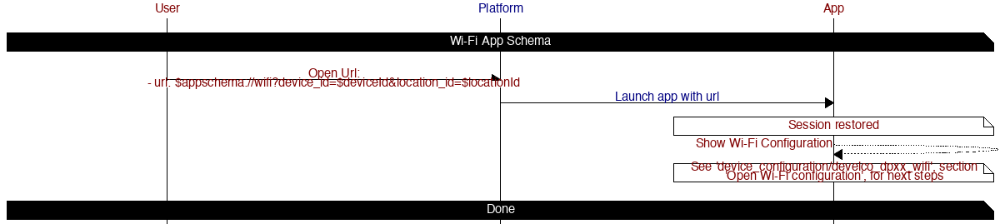

# Mobile App Schema

The client API interface allows for 

## Table of contents

* [Main](#main)
    * [Devices](#devices)
        * [Add Devices](#add-devices)
    * [History](#history)
    * [Dashboard](#dashboard)
    * [People](#people)
        * [Add Person](#add-person)
    * [Community](#community)
* [Account](#account)
* [Settings](#settings)
* [About](#about)
* [Support](#support)
* [Locations](#locations)
* [User Agreements](#user-agreements)
* [Faqs](#faqs)
* [Augmented Reality](#ar)
* [Bundle](#bundle)
    * [OOBE](#oobe)
* [User Codes](#user-codes)
* [Wi-Fi](#wi-fi)
* [OS](#os)
    * [Add Contact](#add-contact)

## Diagrams

### Main

*Path*

`main`

#### Devices

*Path*

`devices`

*Query Parameters*

| Property | Type | Description |
| -------- | ---- | ----------- |
| device_d | String | Segue to device UI |

#### Add Device

*Path*

`main/devices/addDevice`

*Query Parameters*

| Property | Type | Description |
| -------- | ---- | ----------- |
| model_id | String | Segue to installation story for this model |
| story_id | String | Segue to specific story |
| page_index | Int | Segue to specific page within story |

#### History

*Path*

`main/history`

#### Dashboard

*Path*

`main/dashboard`

*Query Parameters*

| Property | Type | Description |
| -------- | ---- | ----------- |
| service | String | Service name provided by Synthetic API [Services](synthetic_apis/services.md)] |
| question_id | String | _Optional_ Segue to a specific question |
| collection_id | String | _Optional_ Segue to a collection of questions |

#### People

*Path*

`main/people`

*Query Parameters*

| Property | Type | Description |
| -------- | ---- | ----------- |
| user_id  | Int  | Segue to specific location user |

#### Add Person

*Path*

`main/people/addPerson`

#### Community

*Path*

`main/community`

*Query Parameters*

| Property | Type | Description |
| -------- | ---- | ----------- |
| post_id  | String | Segue to specific post |
| location_id | String | Segue to specific location |
| community_id | String | Segue to specific community |

### Account

*Path*

`account`

### Settings

*Path*

`settings`

*Query Parameters*

| Property | Type | Description |
| -------- | ---- | ----------- |
| question_id | String | Segue to a specific question |
| collection_id | String | Segue to a collection of questions |

### About

*Path*

`about`

### Support

*Path*

`support`

### Locations

*Path*

`locations`

### User Agreements

*Path*

`userAgreements`

*Query Parameters*

| Property | Type | Description |
| -------- | ---- | ----------- |
| story_id | String | Segue to a specific story ID |
| signature | String | Require user to "sign" agreement |

### Faqs

*Path*

`faqs`

*Query Parameters*

| Property | Type | Description |
| -------- | ---- | ----------- |
| story_id | String | Segue to a specific story ID |

### Augmented Reality

*Path*

`ar`

*Query Parameters*

| Property | Type | Description |
| -------- | ---- | ----------- |
| model_id | String | Segue to AR UI for specified device model |

### Bundle

*Path*

`bundle`

*Query Parameters*

| Property | Type | Description |
| -------- | ---- | ----------- |
| model_id | String | Model ID of this device bundle or accessory |
| status   | String | Status of this device bundle or accessory |

#### OOBE

*Path*

`bundle`

*Query Parameters*

| Property | Type | Description |
| -------- | ---- | ----------- |
| story_id | String | _Optional_ Specific Bundle story ID |

### User Codes

*Path*

`user_codes`

*Query Parameters*

| Property | Type | Description |
| -------- | ---- | ----------- |

### Wi-Fi

Open common Wi-Fi configuration page that lists Wi-Fi access points and allows for password input.

*Path*

`wifi`

*Query Parameters*

| Property | Type | Description |
| -------- | ---- | ----------- |
| device_id | String | Configure specific device |

*Output*

| Property | Type | Description |
| -------- | ---- | ----------- |
| ssid | String | Wi-Fi SSID |
| password | String | Wi-Fi Password |
| secureityType | String | Wi-Fi Security |

### OS

#### Add Contact

*Path*

`os/addContact`

*Query Parameters*

| Property | Type | Description |
| -------- | ---- | ----------- |
| given_name | String | _Optional_ Overrides location, organization, or user contact information |
| family_name | String | _Optional_ Overrides location, organization, or user contact information |
| company_name | String | _Optional_ Overrides location, organization, or user contact information |
| phone_number | String | _Optional_ Overrides location, organization, or user contact information |
| email    | String | _Optional_ Overrides location, organization, or user contact information |
| location_id | Int | _Optional_ Assigns location information as contact |
| organization_id | Int | _Optional_ Assigns organization information as contact |
| user_id  | Int  | _Optional_ Assigns user information as contact |
