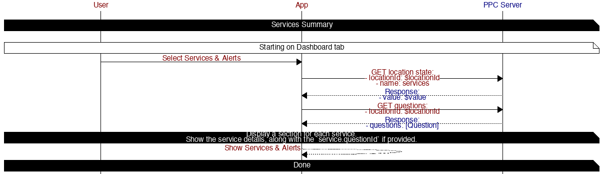

# Services and Alerts

## Table of contents

* [Services Summary](#services-summary)

## Diagrams

### Services Summary

#### APIS

##### [GET State](https://iotapps.docs.apiary.io/#reference/synthetic-apis/states/get-state)

*Refresh services location state*

Params:
- locationId: $locationId
- name: services

##### [GET Questions](https://iotapps.docs.apiary.io/#reference/user-communications/questions/get-questions)

*Refresh questions*

Params:
- locationId: $locationId